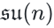
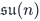
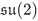
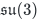

# <sub></sub> Toolkit

This software package aims to provide several tools for working with representations of the Lie-algebras <sub><sub></sub></sub>.

The core library is written in C for efficiency and has bindings for numpy, sympy and Mathematica.

## Setup

Python requirements:

* numpy
* sympy

## Planned Usage

### Python

Irreducibe matrix representations based on a given Dynkin labels can easily be generated. As a sample let's construct Pauli's matrices as an irrep of <sub><sub></sub></sub> and Gell-Mann matrices as an irrep of <sub><sub></sub></sub>.

```python
import sun.numeric as sun

irrep = sun.Irrep(dynkin=[3,8])
irrep.x(i)
```

### Mathematica

```mathematica
Needs["SUN`"]

irrep = Irrep[5,2,1]

X = LieAlgebraBasisMatrices[irrep, BasisType→"LoweringRaising"]
X[i]
```

## Algorithm

The package is an implementation of the algorithm outlined in [1].

[1] Alex, Arne, et al. "A numerical algorithm for the explicit calculation of SU(N) and SL(N, C) Clebsch–Gordan coefficients." *Journal of Mathematical Physics* 52.2 (2011): 023507.

## Planned features

- [x] Generate irreducible representations from Dynkin labels
- [x] Python bindings
- [x] Mathematica bindings
- [ ] Decompose tensor products into irreducible representations
- [ ] Clebsch-Gordon coefficients
