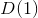
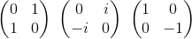

# $SU(n)$ Toolkit

This software package aims to provide several tools for working with representations of the spection unitary group $SU(n)$ and its Lie-algreba $\mathfrak{su}(n)$.

The core library is written in C for efficiency and has python binding for both numpy and sympy as well as Mathematica.

## Setup

Python requirements:

* numpy
* sympy

## Planned Usage

### Python

Irreducibe matrix representations based on a given Dynkin labels can easily be generated. As a sample let's construct Pauli's matrices as an irrep of $\mathfrak{su}(2)$ and Gell-Mann matrices as an irrep of .

```python
import sun.numeric as sun

irrep = sun.Irrep(dynkin=[1])
irrep
```
Output: 

This does not yet generate the matrices. However once we iterate over `irrep` or access an element throught `__getitem__` the matrices are built and stored within the object. The construction can also manually invoked through the function `construct_matrices`.

```python
irrep.construct_matrices()
for X in irrep:
    print(X, end=" ")
```
Output: 

### Mathematica

## Planned features

- [x] Generate irreducible representations from Dynkin labels
- [x] Python bindings
- [ ] Mathematica bindings
- [ ] Decompose tensor products into irreducible representations
- [ ] Matrix exponentials
- [ ] Pedagogical tools for visualizations