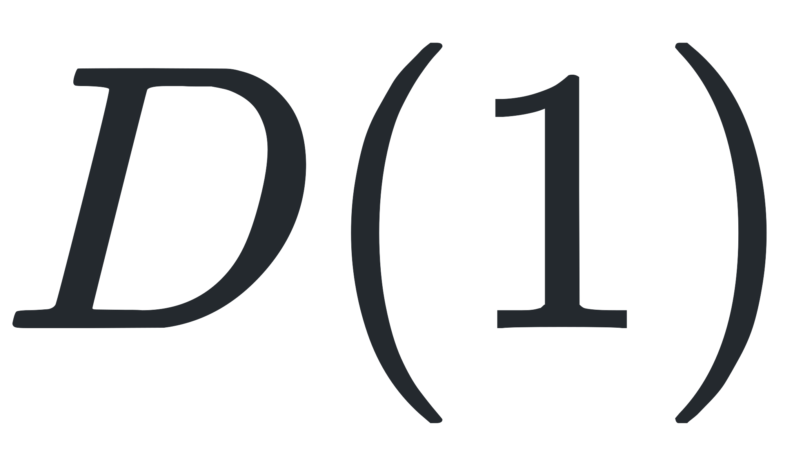

# $\mathfrak{su}(n)$ Toolkit

This software package aims to provide several tools for working with representations of the Lie-algebras $\mathfrak{su}(n)$.

The core library is written in C for efficiency and has bindings for numpy, sympy and Mathematica.

## Setup

Python requirements:

* numpy
* sympy

## Planned Usage

### Python

Irreducibe matrix representations based on a given Dynkin labels can easily be generated. As a sample let's construct Pauli's matrices as an irrep of <sub><sub></sub></sub> and Gell-Mann matrices as an irrep of <sub><sub></sub></sub>.

```python
import sun.numeric as sun

irrep = sun.Irrep(dynkin=[1])
irrep
```
Output: 

<p align="center"></p>


This does not yet generate the matrices. However once we iterate over `irrep` or access an element throught `__getitem__` the matrices are built and stored within the object. The construction can also manually invoked through the function `construct_matrices`.

```python
irrep.construct_matrices()
for X in irrep:
    print(2 * X, end=" ")
```
Output:

<p align="center"></p>

### Mathematica

```mathematica
Needs["SUN`"]

irrep = Irrep[1,0]

X = SUNLieMatrices[irrep, Method→RaisingBasis]
```

## Planned features

- [x] Generate irreducible representations from Dynkin labels
- [x] Python bindings
- [x] Mathematica bindings
- [ ] Decompose tensor products into irreducible representations


